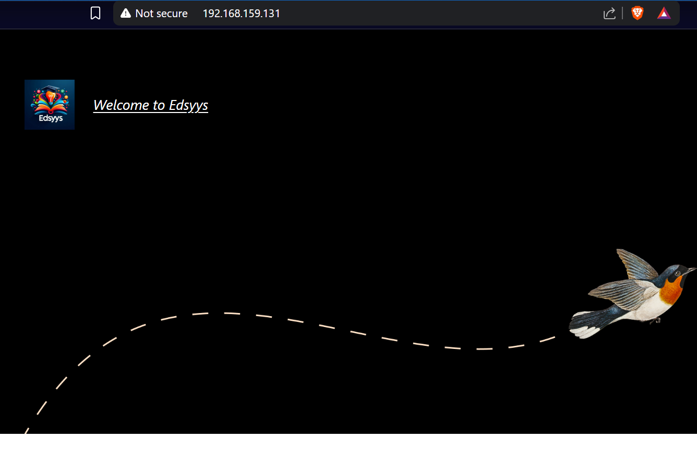
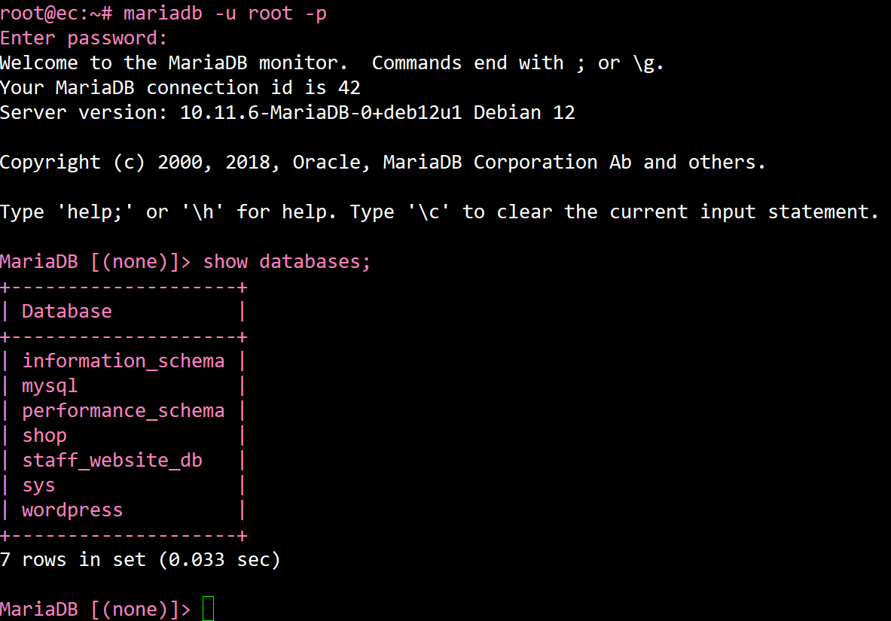
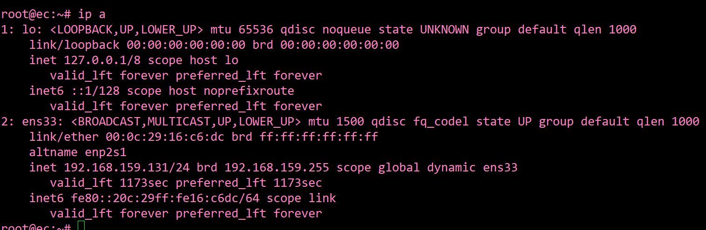
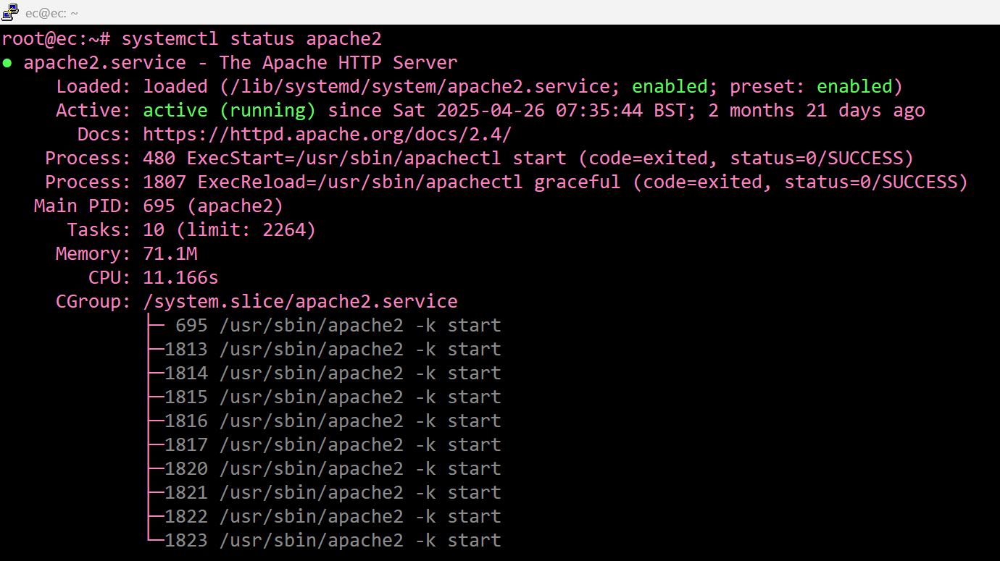

<h1><a href="https://github.com/prsilvaa"> Web Server Administration </a></h1>

<h2>Project Objective</h2>

To set up, configure, and manage a secure Linux-based web server using the LAMP stack, which includes Apache, MariaDB, PHP, and a Content Management System (CMS). This involved hosting both public and private websites, configuring SSL certificates for secure HTTPS access, implementing user access controls, managing database operations, setting up customised logging, performing regular backups, managing user permissions, and ensuring the server's overall security and reliability.

<h2>Tools Used</h2>
<ul>
  <li>Linux Commands </li>
  <li>Wordpress </li>
  <li>Apache2 </li>
  <li>Mariadb </li>
  <li>PHP </li>
  <li>Lamp Stack </li>
  <li>SCP/Tar </li>
  <li>SSL </li>
  <li>CMS </li>
  <li>htaccess </li>
  <li>Logging Tools </li>
</ul>

<h2>Skills Gained</h2>
<ul>
    <li>Server Setup</li>
    <li>File Permissions</li>
    <li>Database Administration</li>
    <li>Backup & Restore</li>
    <li>SSL Configuration</li>
    <li>Access Control</li>
    <li>Web Hosting</li>
</ul>

<h2>Outcome</h2>

Successfully deployed both public and private websites using a Content Management System (CMS), configured and secured an intranet, implemented HTTPS access with SSL certificates, customised logging, and set up automated backups. User access was managed securely, allowing web designers to upload files via SCP, ensuring a fully operational, reliable, and secure Linux-based web server environment.

    <h3>WordPress Website</h3>
    
    
Public website running on WordPress CMS with custom theme and logo.

    <h3>MariaDB Database</h3>
    
    
MariaDB running to handle database operations for web applications.

    <h3>Server IP Address</h3>
    
    
Local server IP address configured for network access and hosting.

    <h3>Apache2 Web Server</h3>
    
    
Apache2 web server running, hosting multiple websites over HTTP and HTTPS.

